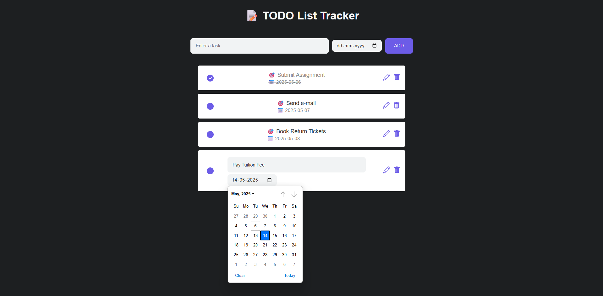

# TODO List Tracker

This is a TODO list tracker application built using the **MERN stack (MongoDB, Express, React, Node.js)**. It allows users to manage their tasks effectively — you can add, update, mark as completed, or delete tasks.

---

## 📋 Prerequisites

Before running the application, ensure you have the following installed:

- [Node.js and npm](https://nodejs.org/)
- [MongoDB](https://www.mongodb.com/try/download/community)
- [MongoDB Compass (Optional)](https://www.mongodb.com/products/compass) – GUI for database management

---

## ⚙️ Setup Instructions

### 1. Clone the Repository

```bash
git clone https://github.com/kram-12/todo-list-tracker.git
cd todo-list-tracker
````

### 2. Install Dependencies

Open a split terminal or two separate terminals:

#### Backend

```bash
cd backend
npm install
```

#### Frontend

```bash
cd frontend
npm install
```

### 3. MongoDB Setup

1. Open **MongoDB Compass** (or use the Mongo shell)
2. Create a new database named: `Todo`
3. Inside the `Todo` database, create a collection named: `todos`

### 4. Environment Setup

Create a `.env` file in the `backend` directory with the following content:

```
PORT=5000
MONGO_URI=mongodb://127.0.0.1:27017/Todo
```

> You can change the `PORT` number if needed.

---

## 🚀 Running the App

### Start Backend Server

```bash
cd backend
npm start
```

Server will run at: [http://localhost:5000](http://localhost:5000)

### Start Frontend Client

```bash
cd frontend
npm start
```

Client will run at: [http://localhost:3000](http://localhost:3000)

---

## 💡 Usage

Open your browser and navigate to [http://localhost:3000](http://localhost:3000).

You can:

* Add new tasks
* Edit/update existing tasks
* Mark tasks as completed
* Delete tasks

---

## 🖼️ Output

> *(Add screenshots here)*




---

## 🤝 Contributing

Feel free to fork this repository and submit pull requests to improve the project.

---

## 📄 License

This project is licensed under the **MIT License**. See the [LICENSE](./LICENSE) file for details.

